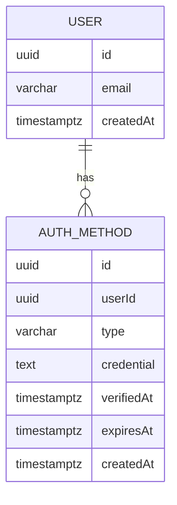
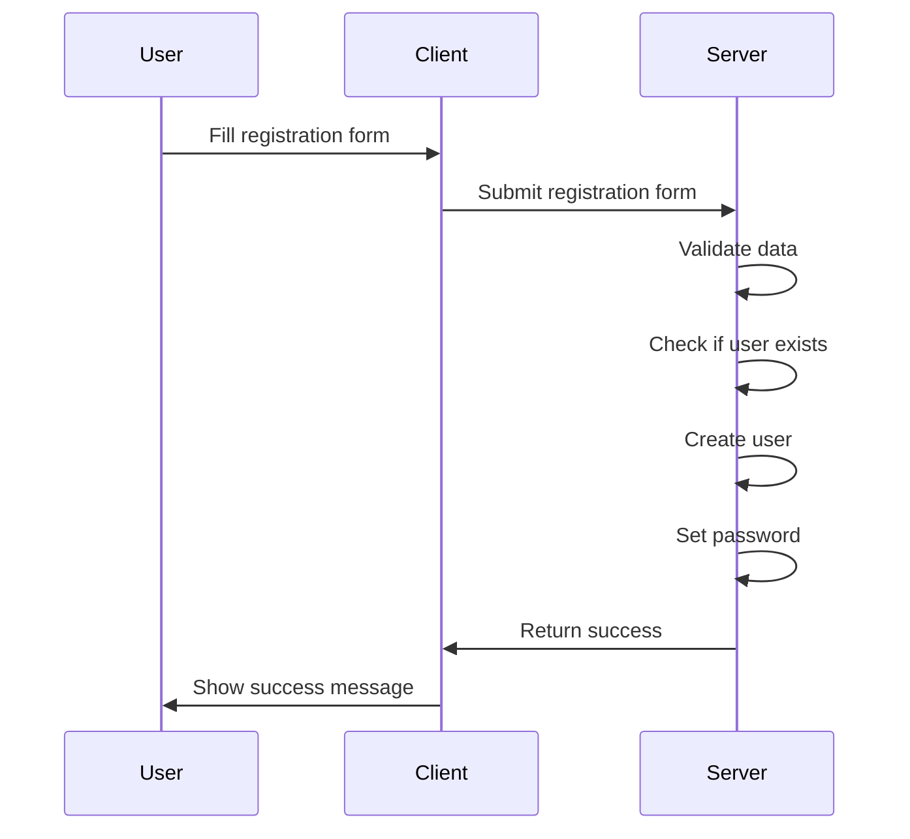
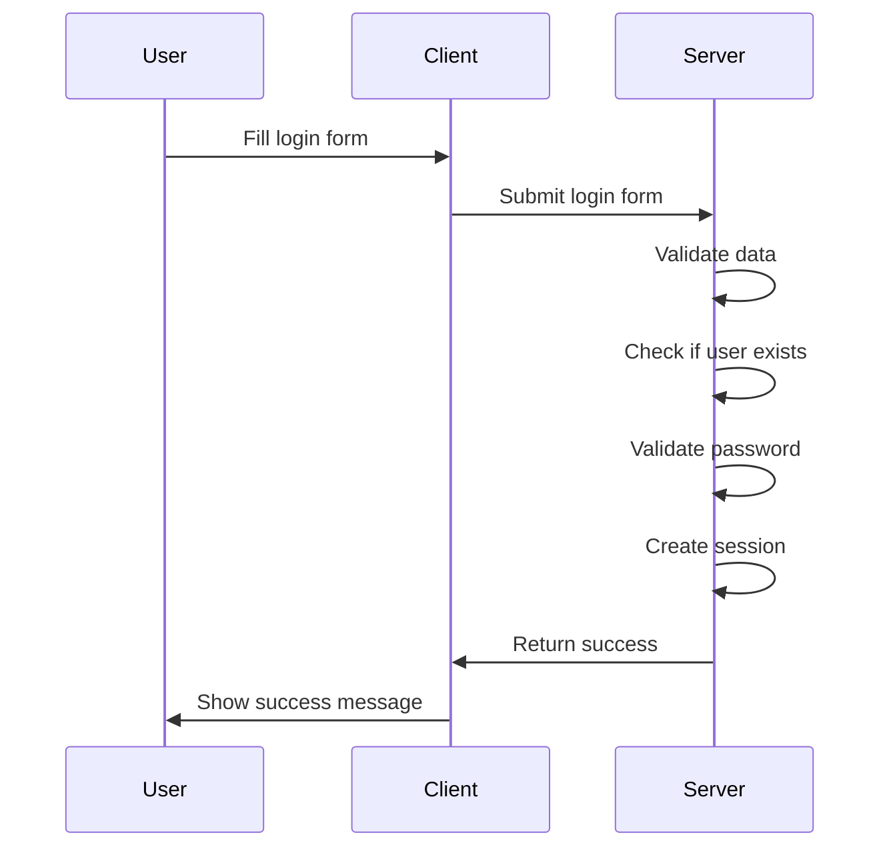
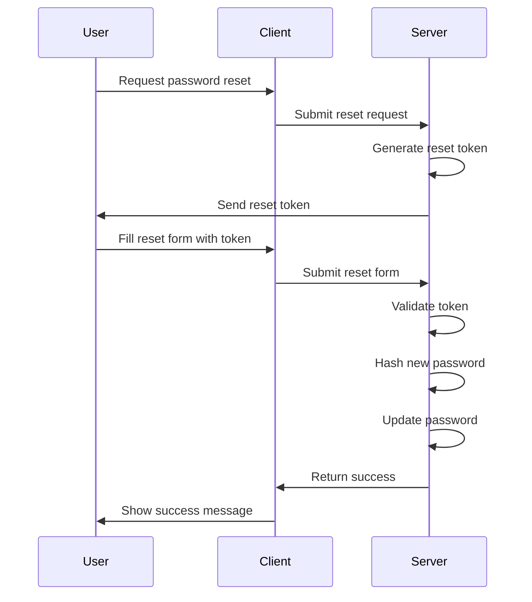
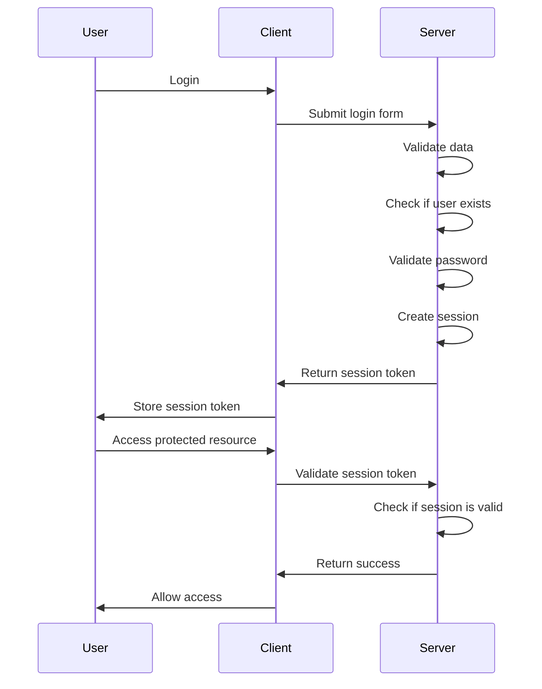
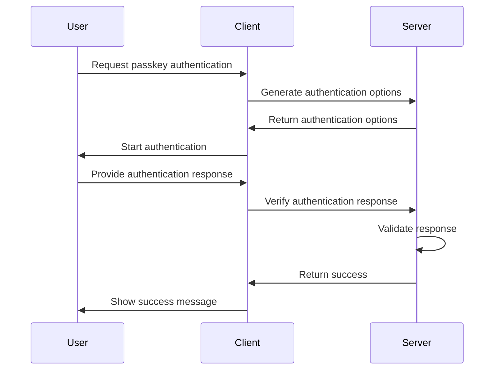

# Project Summary

⚠️ For all enforceable rules and standards, see `.cursor/rules/`. This README is for usage, onboarding, and high-level documentation only.

This project is a user authentication system built with Next.js. It includes various components and hooks to handle user registration, login, password reset, and session management.

## Main Entities and Relationships



## Core Functions and Usage

### User Registration

The `register` function handles user registration. It validates the input data, checks if the user already exists, creates a new user, and sets the password.

```typescript
import { register } from "@/app/(auth)/actions";

const formData = new FormData();
formData.append("email", "user@example.com");
formData.append("password", "password123");

const state = await register({ status: "idle" }, formData);
```

### User Login

The `login` function handles user login. It validates the input data, checks if the user exists, validates the password, and creates a session.

```typescript
import { login } from "@/app/(auth)/actions";

const formData = new FormData();
formData.append("email", "user@example.com");
formData.append("password", "password123");

const state = await login({ status: "idle" }, formData);
```

### Password Reset

The `resetPassword` function handles password reset. It validates the token, hashes the new password, and updates the password.

```typescript
import { resetPassword } from "@/app/(auth)/lib/db/queries";

const token = "reset-token";
const newPassword = "newpassword123";

await resetPassword(token, newPassword);
```

### Session Management

The `createSession`, `renewSession`, and `validateSession` functions handle session management.

```typescript
import { createSession, renewSession, validateSession } from "@/app/(auth)/lib/db/queries";

const userId = "user-id";
await createSession(userId);

const sessionToken = "session-token";
await renewSession(sessionToken);

const isValid = await validateSession(sessionToken);
```

### Generation of UUIDs as Credentials (Tokens)

UUIDs are generated as credentials (tokens) for each authentication method in the `createAuthMethod` function in `app/(auth)/lib/db/queries.ts`. If no credential is provided, a UUID is generated.

The following functions use `createAuthMethod` to generate tokens:
- `createSession` in `app/(auth)/lib/db/queries.ts` generates a session token.
- `resetPassword` in `app/(auth)/lib/db/queries.ts` generates a reset password token.
- `sendVerificationEmail` in `app/(auth)/lib/email.ts` generates a verification token.
- `sendResetPasswordEmail` in `app/(auth)/lib/email.ts` generates a reset password token.
- `createPasskey` in `app/(auth)/lib/db/queries.ts` generates a passkey token.
- `createPassword` in `app/(auth)/lib/db/queries.ts` is the only method where a token is not generated. Instead, a hashed password is stored.

### Explanation of expiresAt and verifiedAt

For each authentication method, the `expiresAt` field indicates when the token will expire, and the `verifiedAt` field indicates when the token was verified.

## User Authentication Flows

### Registration Flow



## Database Type Generation

This project uses [kysely-codegen](https://github.com/kysely-org/kysely-codegen) to generate TypeScript types from the live database schema.

- **Script:** `npm run db:typegen`
- **Output:** `app/(auth)/lib/types/database.generated.ts`
- **When to run:** After every migration or schema change.

This ensures your TypeScript types stay in sync with your database schema. Never edit the generated file by hand.


### Login Flow



### Password Reset Flow



### Session Management Flow



### Passkey User Authentication Flow



The passkey user authentication flow involves generating options, starting authentication or registration, and verifying responses. This flow aligns with other documented authentication methods.

## OpenAPI Specification

This project includes an OpenAPI specification file (`openapi.yaml`) in the root directory. **Whenever you add, change, or remove any API endpoints, you must update `openapi.yaml` to reflect those changes.**

- The OpenAPI file documents all public API endpoints, their request/response formats, and error codes.
- Code reviews should verify that `openapi.yaml` is kept up to date with the implementation.
- Keeping this file current ensures accurate API documentation and helps with client/server integration, testing, and onboarding.

## Error Handling

This project uses a centralized error registry (`app/(auth)/lib/errors.ts`) for consistent error handling across all API endpoints.

- **Standardized error codes and messages** for all error scenarios
- **Proper HTTP status codes** mapped to each error type
- **Structured error responses** with timestamps and additional details
- **Type safety** with TypeScript and Zod integration
- **Automatic error handling** for validation errors and unknown exceptions

For detailed usage instructions and examples, see [docs/error-handling.md](docs/error-handling.md).

**Key benefits:**
- Consistent error responses across all endpoints
- Easy client-side error handling with machine-readable codes
- Simplified debugging with structured error details
- Type-safe error creation and handling

## Type System

This project uses a centralized type system (`app/(auth)/lib/types/index.ts`) that serves as the single source of truth for all shared types.

- **Database types** from Kysely (User, AuthMethod, etc.)
- **API request/response types** for all endpoints
- **Zod schemas** for validation and type inference
- **Error types** integrated with the error registry
- **Utility types** for common patterns (pagination, API responses)
- **Type guards** for runtime type checking
- **Constants** for configuration and auth method types

For detailed documentation and usage examples, see [docs/type-system.md](docs/type-system.md).

**Key benefits:**
- Single source of truth for all types across the application
- Type safety from database to API responses
- Consistent validation with Zod schemas
- Easy refactoring with centralized type changes
- Better IDE support and LLM-friendly documentation

## Changelog Usage

This project uses a `CHANGELOG.md` to track all notable changes. Please follow these steps:

- Before committing any new feature, fix, or breaking change, add an entry to the `Unreleased` section of `CHANGELOG.md`.
- Use the [Keep a Changelog](https://keepachangelog.com/en/1.0.0/) format for consistency.
- When preparing a release, move entries from `Unreleased` to a new version section with the release date.
- Keeping the changelog up to date helps with transparency, onboarding, and release management.
