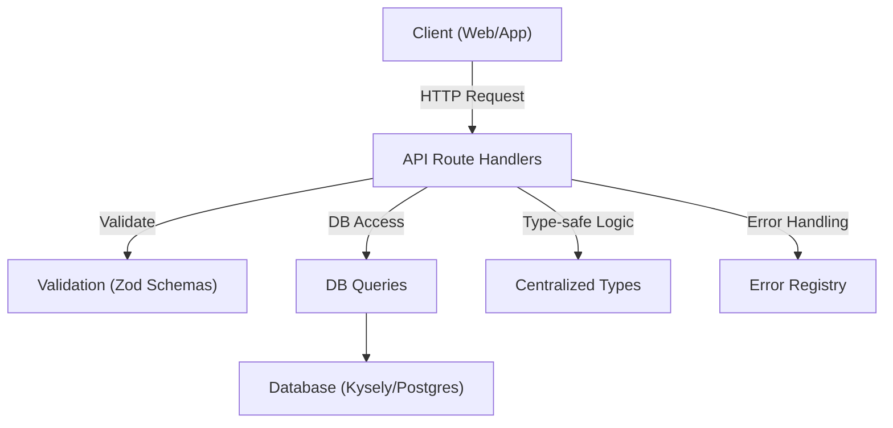

# Architecture Overview

This document provides a high-level overview of the system architecture, including the main modules, their responsibilities, and how data flows through the application.

## System Diagram

## Main Modules

- **Client:** Sends requests to the API and receives responses.
- **API Route Handlers:** Entry point for all requests. Handles validation, business logic, and responses.
- **Validation (Zod Schemas):** Validates all incoming and outgoing data for type safety and security.
- **DB Queries:** Encapsulates all database access logic using Kysely.
- **Database:** Stores all persistent data (users, sessions, auth methods, etc.).
- **Centralized Types:** Provides a single source of truth for all types used across the system.
- **Error Registry:** Centralizes error codes, messages, and status codes for consistent error handling.

## Data Flow
1. Client sends a request to the API.
2. API handler validates the request using Zod schemas.
3. API handler uses centralized types for type safety.
4. If needed, API handler calls DB queries to read/write data.
5. Errors are handled using the error registry for consistent responses.
6. API returns a validated, type-safe response to the client.

---
For more details, see [ONBOARDING.md](./ONBOARDING.md), [type-system.md](./type-system.md), and [error-handling.md](./error-handling.md). 